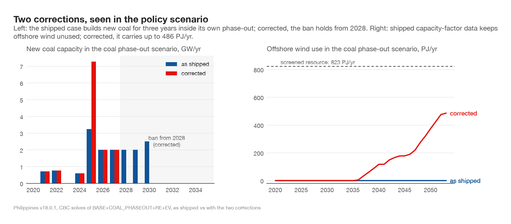

# Philippines v18 offshore wind resource and coal-moratorium date

## Reason

Two inputs in v18.0.1 contradict their evidence. First, `PHL_POW_PP_WOF` (offshore wind)
carries a 3,949.31 PJ/yr activity ceiling — 4.8x the screened national resource — and a
capacity-factor profile averaging 29.3%, which makes offshore look ~50% more expensive
per unit of energy than the evidence supports; the policy scenario never builds it.
Second, the COAL_PHASEOUT layer bans new coal investment only from 2031 while the base
deployment envelopes allow 2-2.5 GW/yr through 2030, so the phase-out scenario builds
6.5 GW of new coal in 2028-2030.

## Source change

`scripts/apply_philippines_v18_offshore_and_moratorium.py`, applied to a copy of the
case, changes only:

- `RYT.json` `TAU` for `PHL_POW_PP_WOF`: post-2020 cells capped at 823 PJ/yr
  (World Bank/ESMAP Offshore Wind Roadmap for the Philippines, April 2022: 58 GW of
  screened technical potential at 45-47% capacity factor).
- `RYTTs.json` `CF` for `PHL_POW_PP_WOF`: profile rescaled to a 45% annual mean,
  seasonal shape preserved (same source).
- `RYT.json` `TAMaxCI` for `PHL_POW_PP_COAL` in the COAL_PHASEOUT layer only: 0 from
  2028; earlier cells left empty so the composition inherits the base deployment
  envelope. The DOE moratorium (October 2020, reaffirmed May 2026) exempts committed
  projects with operations through 2027. Note for any layered edit: an explicit
  scenario-layer value overrides the base; an empty cell inherits.

## Validation (CBC, v18.0.1, base and full policy composition)

| run | total discounted system cost (million US$) | result |
|---|---|---|
| Base, as shipped | 369,743,573.76856 | reference |
| Base + fixes | 369,743,573.76859 | difference 3.5e-5: the fixes do not touch the base |
| Policy, as shipped | 369,766,929.90705 | 6.5 GW new coal 2028-2030; offshore never used |
| Policy + fixes | 369,768,776.18784 | zero new coal from 2028; offshore up to 486 PJ/yr, under the 823 cap every year |

The as-shipped policy objective reproduces the value in
MODEL_FIXES_RE_NUCLEAR_CAPS_2026-08-13.md (369,766,929.907) to 2e-4.

One expected side effect, visible in the figure: with the earlier ban, the optimiser
anticipates and builds more coal in 2025 (7.3 vs 3.2 GW). The concentration in 2025 is
enabled by that envelope cell being an open 9999 placeholder rather than a historical
value — a separate data gap worth its own fix. Total new coal still falls (13.4 vs
15.8 GW).
